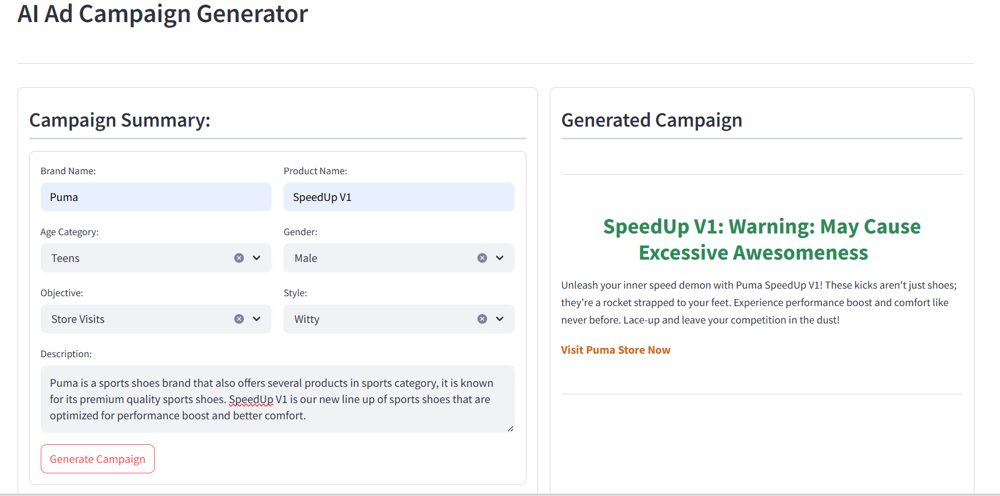

# 🧠 AI Ad Campaign Generator

A **Streamlit** app that uses **Google Gemini AI** models to generate engaging digital ad campaigns—complete with headlines, descriptions, calls-to-action, and even visual creatives. Just fill in the brand and audience details, and get an ad ready to go!

---

## 🚀 Features

* ✍️ **Generates compelling ad copy** (headline, description, CTA)
* 🎨 **Creates a matching image** using Gemini's multimodal model
* ⚙️ **Structured output** using Pydantic for clean formatting
* 🎯 Personalized ads based on target audience and campaign goals

---

## 📁 File Structure

```
.
├── app.py         # Main Streamlit app UI and logic
├── llm.py         # LLM logic, prompt template, and model setup
├── .env           # (Optional) Environment variable for API key
├── README.md      # You're here!
```

---

## 🛠️ How It Works

1. **User Input**: The app collects campaign details from the user:

   * Brand and product name
   * Age category and gender of audience
   * Campaign goal and tone
   * Short brand/product description

2. **Text Generation**: The `ad_chain` LLM generates:

   * 🧢 Headline
   * 📄 Ad Description
   * 🎨 Image Prompt
   * 📢 Call to Action

3. **Image Generation**: A second LLM (`image_llm`) uses the image prompt to return a creative visual in base64 format.

4. **Display**: Both ad copy and image are rendered in the right panel of the UI.

---

## 🧪 Tech Stack

* [Streamlit](https://streamlit.io/) – Fast interactive UI
* [LangChain](https://www.langchain.com/) – Prompt management and model chaining
* [Google Gemini API](https://ai.google.dev/) – LLM for text + image generation
* [Pydantic](https://docs.pydantic.dev/) – For output validation and structure

---

## 🔐 Setup Instructions

1. **Clone the repository**

```bash
git clone https://github.com/yourusername/ai-ad-campaign-generator.git
cd ai-ad-campaign-generator
```

2. **Install dependencies**

```bash
pip install streamlit langchain-google-genai langchain-core pydantic python-dotenv
```

3. **Configure API Key**

Set your Google AI API key:

* Option 1: Create a `.env` file with:

  ```
  GOOGLE_API_KEY=your_key_here
  ```

* Option 2: Let the app prompt you for the key on first run.

4. **Run the app**

```bash
streamlit run app.py
```

---

## 🖼️ Example Output

> **Headline**: "Power Up Your Playtime!"

> **Ad Description**: Introducing our latest gaming console designed for teens seeking thrill and speed. Small in size, massive in performance.

> **Call to Action**: Order now and level up your experience!

> ![Generated Ad Image]## 🖼️ Screenshots

### 🎯 Campaign Input Form


### 📢 Generated Ad Output


---

## 🧠 Inspiration

Built to help small businesses and marketers auto-generate creative, engaging campaigns—without hiring a full creative team!

---

## 📝 License

This project is for educational and personal use. Modify and share freely. Please credit the original authors where applicable.

---

Let me know if you'd like a version with badges or screenshots embedded!
